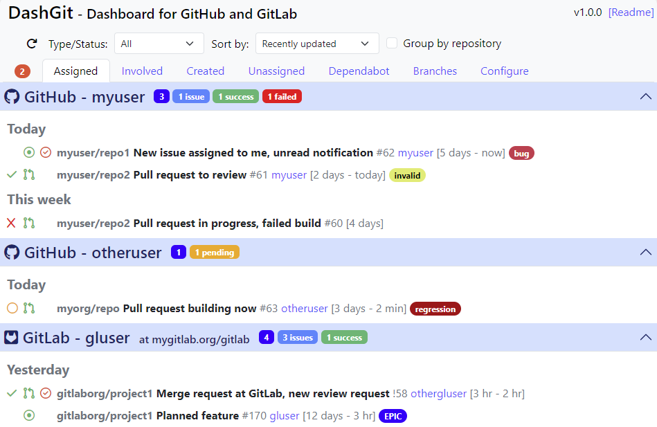

[Features and Configuration](#features-and-configuration)
| [Combined Dependabot Updates](#combined-dependabot-updates)
| [Contributing](contributing)

# DashGit - A Dashboard for GitHub and GitLab repos

This dashboard provides a consolidated view of your latest work items 
(open issues, pull requests, review requests, branches, dependabot updates) 
along with build statuses and notifications for multiple GitHub and GitLab repositories.
It also allows you to combine dependabot updates into one pull request per repository
and merge them automatically with just a few clicks.

It works entirely in the browser and is hosted on the GitHub Pages of this repo at
[https://javiertuya.github.io/dashgit](https://javiertuya.github.io/dashgit).
The only data sent outside of the browser is the
required to request the repositories to get your work items.

This is an example view of DashGit configured to manage two GitHub and one GitLab repositories:

## Quick Start

To start, enter into DashGit at [https://javiertuya.github.io/dashgit](https://javiertuya.github.io/dashgit),
go to the Configure tab and specify a GitHub provider by setting your username and an access token.
Leave other parameters to their default values.
You can omit the token, but this is subject to lower rate limits and does not allow you to view the branches tab, build statuses and notifications.

The configuration is stored in the local browser memory. 
To protect the tokens you can encrypt them with a password that will be requested when you open a new DashGit browser tab.

## Features and Configuration

The different *views* (tabs) shown in the UI display the open *work items* (issues, pull requests, etc.) in a collapsible panel for each *provider*.
A provider is defined by a repository type (GitHub, GitLab), an *user* and an access *token* to authenticate the requests. 
You can define any combination (e.g. providers with the same username but different token, or different username but same token).

### Api acces token encryption
As mentioned before, the configuration is stored in the browser local memory and all processing occours in the browser.
To protect sensistive information (the access tokens) the user is given the option to encrypt the tokens using a password.
If you set a password, the next time that you open DashGit you will be asked for the password.

If you forgot the password, you are given with the option of skip. In that case you may notice that api calls fail, you should go
to the configuration to reset the tokens to an empty value.
Note that once a token is encrypted, you can't decrypt it, only reset.

### Selecting, sorting and grouping
The user can customize how the work items are sorted and organized by setting the controls that appear at the top of the header.
This settings are no stored in the configuration.

### Scope configuration
The username is the reference user for which the work items are displayed (assigned to, created by, etc.)
and the token defines the scope of the request that determines what items are displayed.
Note that the username can be someone other the token owner.

- The scope of Assigned, Involved and Created views is whatever repository visible for the token.
- The scope of Unassigned and Dependabot views is restricted to the repository of the token owner. 
  If you need include other users or organizations, you must include them in the `Add owners to unassigned`
  or `Add owners to dependabot` parameters, respectively.
- The scope of Branches view is handled differently, as data is obtained by the GraphQL API requests insetead of the REST API.
  On GitHub you will specify one or more than the following scopes: OWNER, ORGANIZATION_MEMBER or COLLABORATOR.

### Filtering
The requests made against the repositories get the most recent work items that fit on a single response page,
that is enough for the most common use case to display the open work items regarding the user.
Moreover the data displayed can be restricted by setting any of the following parameters:
- `Max age`: Filters out the work items that are older than the days specified.
- `Filter if Label`: Filters out the work items that contain the label specified.

### Status cache
Requests to the GraphQL API to get the branches and build statuses are expensive if they retrieve data
from many repositories and are subject to more restrictive rate limits than REST API.
To mitigate potential problems with API rate limits and improve the UI response times, these calls are cached and managed
by two parameters (measured in seconds):
- `Status Cache Update Time`: During this period, any call to get statuses returns the cached data.
  This is to avoid making API calls when the user moves from a view to another in a short period of time.
  When this period of time expires, the cache will be incrementally updated by requesting 
  data only from the latest updated projects.
- `Status Cache Refresh Time`: It specifies a much longer period than `Status Cache Update Time`.
  When this period of time expires, the cache is fully refreshed.

## Combined Dependabot Updates

From the Dependabot tab you can combine pull requests with dependency updates generated by dependabot
into a sigle PR per repository and merge them automatically with just a few clicks. 

As DashGit works entirely in the browser without a backend server, you have to set up a dedicated (private) repository 
that we call *update manager*. 
After you confirm the updates to be combined, DashGit pushes a json file with this information to the update manager
(*update payload*).
Then, the update manager runs a GitHub Actions workflow to create each combined pull request, resolve merge conflicts
with adjacent lines and enable automerge.
The combined PR will be merged if the build is successful.

This requires a little configuration described below:
- Create the update manager repository in GitHub: It is recommended to keep private, since although no token is sent to it, 
  the logs may contain sensitive information such as urls or usernames 
  (when the repository that is being updated is private or on-premises).
- Activate the combined updates feature: Go to the config tab and check the Enable combined dependency updates option.
  Provide the name of the update manager repository (REPO/OWNER) and the token used to push the update payload.
- Configure the workflow: Go to the Dependabot tab and follow the instructions to obtain the content of the
  `.github/workflows/manage-updates.yml`. Add this file to the update manager repository.
- Set the api access tokens: In each provider on the dependabot tab, you will see the name of a token. 
  Create these tokens in the update manager. Their stored value has to be a token used to create the combined PRs

Notes:
- On GitLab the projects have automerge enabled by default, but on GitHub you need to explicitly enable per repository
  from Settints->General. It is recommended to activate the automatic deletion of head branches when PRs are merged.
- On GitHub, to automerge when the build succeeds you have to configure the repository to require status checks to pass before merging
  (to do so, create an branch protection rule on the main branch, check this option and specify the checks that must pass)
- On GitLab, you can generate dependabot updates using the [Dependabot Script](https://github.com/dependabot/dependabot-script)
  or using [this more customized version of Dependabot Script](https://github.com/javiertuya/dependabot-script).

## Contributing

This repository follows the general contribution policies and guidelines at the giis-uniovi org:
[CONTRIBUTING.md](https://github.com/giis-uniovi/.github/blob/main/profile/CONTRIBUTING.md)

If you plan to make any contribution, please, first create an issue to discuss the approach before starting development.

### Testing

This table summarizes the test strategy (explained below):

| Feature\\Test level | Unit | Integration | System (E2E) |
| :------------------ | :--: | :---------: | :----------: |
| View work items  | (1) |     | (5) |
| Configuration    | (1) |     | (5) |
| Combined updates |     | (2) | (4) |
| Merge conflicts  | (3) | (2) |     |

1. View work items & configuration: Mocha tests in `dashgit-web/test-web/test`. 
   Transformations from api responses to the model displayed in the UI and funtions related to the configuration.
   Run in CI, job `test-ut`.
2. Combined updates: JUnit tests in `dashgit-updater`: `TestIt*`. 
   Covers GitHub and GitLab, with and without merge conflicts.
   Requires a previous configuration of twp dedocated test repos, see `TestItGithubLiveUpdates.java` for instructions
   and the subclass `TestItGitlabLiveUpdates.java`.
   Run in CI, matrix jobs `test-it *`.
3. Merge conflicts: JUnit tests in `dashgit-updater`: `TestUt*`. 
   Covers different situations related to the resolution of git merge conflicts.
   Run in CI as part of the the IT jobs. 
4. Combined updates: Only automates the test data preparation using a JUnit test in `dashgit-updater`: `TestE2eLiveUpdatesSetup.java`.
   Follow the instructions in this test class.
5. Manual tests: Not yet automated.
