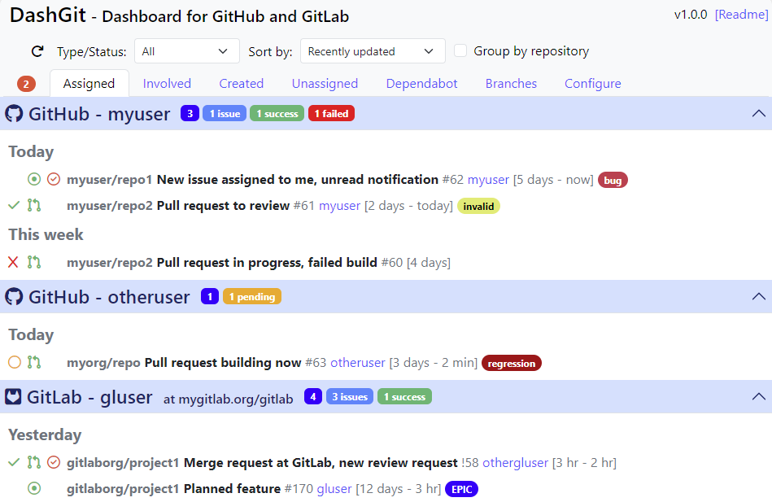

# DashGit - A Dashboard for GitHub and GitLab repos

[Overview](#overview)
| [Quick Start](#quick-start)
| [Features and Configuration](#features-and-configuration)
| [Advanced Features](#advanced-features)
| [Combined Dependabot Updates](#combined-dependabot-updates)
| [Follow-up](#follow-up)
| [Contributing](contributing)

## Overview

This dashboard offers:
- A unified view of multiple GitHub and GitLab repositories.
- Authentication using OAuth2 or Personal Access Tokens (PAT)
- Multiple perspectives on your work items, including:
  - Open issues and pull requests
  - Review requests and requests for changes
  - Branches and Dependabot updates
- Build statuses for PRs/branches and notifications
- The ability to automatically combine Dependabot updates into a single pull request per repository and merge them with just a few clicks
- The option to flag work items with a reminder date for follow-up.

DashGit works entirely in the browser and is hosted on GitHub Pages at
[https://javiertuya.github.io/dashgit](https://javiertuya.github.io/dashgit).
The only data sent outside the browser is what is required to request repository information about your work items
or to get the OAuth2 authorization.

Below is an example view of DashGit configured to manage two GitHub and one GitLab repositories:

## Quick Start

To get started, go to [https://javiertuya.github.io/dashgit](https://javiertuya.github.io/dashgit),
open the Configure tab, add a GitHub provider:
- Enter your username
- Set the authentication method:
  - Select the OAuth2 authentication switch
  - Or set a Personal Access Token (classic) with `repo` and `notifications` permissions
    (see below for how to narrow the scope of tokens or use fine-grained tokens).
- Leave other parameters at their default values.
- You can access without authentication, but this will subject you to lower rate limits and will not allow you to view the branches tab, build statuses, or notifications.

The configuration is stored in your browser's local storage.
OAuth tokens are stored in session storage, dropped after closing the browser tab.
If you authenticate using Personal Access Tokens (PAT) you can encrypt them with a password, which will be requested when you open a new DashGit browser tab.

## Features and Configuration

The different *views* (tabs) in the UI display open *work items* (issues, pull requests, etc.) in a collapsible panel for each *provider*.
A provider is defined by a repository platform (GitHub, GitLab), a *user*, and an method (OAuth or PAT) to authenticate requests.
You can define any combination (e.g., providers with the same username but different authentication, or different usernames but the same authentication).

### OAuth authentication

OAuth2 authentication implements the *Authorization code with Proof Key for Code Exchange (PKCE)* protocol.
Out of the box, it uses a predefined GitHug OAuth App or GitLab Application to handle de authorization process.
In the configuration of each provider, you only need check *Use OAuth2 to authenticate* instead of introducing a Personal Access Token (PAT).

The OAuth tokens received after authorization only live during the session and they are not stored in the browser's local storage (unlike PAT).
For more details and the customization features, see [OAUTH2.MD](dashgit-web/OAUTH2.md).

### PAT token permissions
Each tab in DashGit issues different API calls to the repository APIs to get issues, pull requests, notifications, branches, and build statuses,
which require different permission levels.
Below, required token permissions are described for different scenarios when using PAT:

- **GitHub authenticated with personal access tokens (classic):**
  - To access public and private repositories: `repo` and `notifications` permissions (recommended).
  - To access public repositories and private repositories owned by you, but not other repositories where you are a collaborator:
    `repo:status`, `repo:public_repo`, and `notifications`
- **GitHub authenticated with fine-grained tokens:** Note that at the time of writing this documentation, the fine-grained token feature is still in beta:
  - Currently, private repositories not owned by you cannot be accessed using fine-grained tokens
    (see below for accessing private organization repositories).
  - To access public repositories and private repositories owned by you, but not other repositories where you are a collaborator:
    Set read-only repository permissions: `Commit statuses`, `Contents`, `Issues`, `Metadata`, `Pull requests`.
    You should also set the `Notifications` permission; however, this is not yet supported (even though the documentation mentions it).
    As a result, you will not be able to see notifications/mentions.
- **GitHub authenticated with fine-grained tokens to access organization repositories:**
  You can access private organization repositories provided that:
  - The organization has enabled fine-grained tokens.
  - When creating the token, you specify the organization as the **resource owner**.
  - The token has the aforementioned permissions: `Commit statuses`, `Contents`, `Issues`, `Metadata`, `Pull requests`
    (and `Notifications` when available).
- **GitLab:** Set a personal access token with `read_api` permission.

### PAT token encryption
As mentioned above, the configuration is stored in the browser's local storage and all processing occurs in the browser.
To protect sensitive information (the PATs), the user is given the option to encrypt them using a password.
If you set a password, the next time you open DashGit you will be asked for it.

If you forget the password, you are given the option to skip. In that case, you may notice that API calls fail: you should go
to the configuration to reset the tokens.
Note that once a token is encrypted, you can't decrypt it, only reset it.

### Selecting, sorting, and grouping
The user can customize how work items are sorted and organized by using the controls at the top of the header.
An additional option allows you to restrict the displayed items to repositories that match a specified search criterion.
These settings are stored in the configuration and persist between sessions.

### Scope configuration
The *username* is the reference user for whom the work items are displayed (assigned to, created by, etc.),
and the authenticated user (OAuth or PAT owner) defines the scope of the request that determines what items are displayed.
Note that the username can be someone other than the authenticated user.

- The scope of Assigned, Involved, and Created views is any repository visible to the authenticated user.
- The scope of Triage (unassigned) and Dependabot views is restricted to the repository of the authenticated user.
  If you need to include other users or organizations, you must set them in the `Add owners to triage` (unassigned)
  or `Add owners to dependabot` parameters, respectively.
- The scope of the Branches view is handled differently, as data is obtained by GraphQL API requests instead of the REST API.
  On GitHub, you have to specify one or more of the following scopes: OWNER, ORGANIZATION_MEMBER, or COLLABORATOR.
  Optionally, you can include PRs from other repositories even if they are out of scope.
- The branch/PR statuses obtained from the same query as the branches view.

### Filtering configuration
Requests made against the repositories retrieve the most recent work items that fit on a single response page,
which is enough for the most common use case to display open work items for the user.
Moreover, the displayed data can be restricted by setting any of the following parameters:
- `Max age`: Filters out work items that are older than the specified number of days.
- `Filter if Label`: Filters out work items that contain the specified label.
- `Match criterion`: On GitHub, it is possible to include or exclude work items in the repositories owned by certain users or organizations

### Configuration for multiple providers

You can use different providers in different Git platforms (e.g. GitHub and GitLab) or in the same platform but with different users.
You can also configure different providers for the same user in the same Git platform but still separate the work items to keep things more organized.
Let assume that you want to separate the work items in your personal account from the work items in an organization that you have access to.

Configuration for GitHub could be like this:
- Create two GitHub providers and set the same user and authentication.
- Add the organization name to `Add owners to triage`, `Add owners to dependabot` in both providers.
- Set the `GraphQL scope` to Owner and Organization member in both providers.
- In the first one, set the `Match criterion` to Exclude and match the organization. This will show your personal repos.
- In the second one, set the `Match criterion` to Include and match the organization. This will show your organization repos.

With this configuration, each provider will send separate (and equal) GraphQL calls for obtaining the statuses and the branches of each provider. 
To avoid the duplication of these calls, that are expensive, you can specify a provider as a surrogate of other. 
In this example, you should:
- Set the `Use a status surrogate` in one of the providers, for instance, the first one.
- Specify the username of the surrogate provider, in this case the username of the second one.

### Status cache configuration
Requests to the GraphQL API to get branches and build statuses are expensive if they retrieve data
from many repositories and are subject to more restrictive rate limits than the REST API.
To mitigate potential problems with API rate limits and improve UI response times, these calls have a two level cache and managed
by two parameters (measured in seconds) that you can adjust in the Configuration tab:
- `Status Cache Update Time`: During this period, any call to get statuses returns the cached data.
  This avoids making API calls when the user moves from one view to another in a short period of time.
  When this period expires, the cache will be incrementally updated by requesting
  data only from projects that had recent commits.
- `Status Cache Refresh Time`: This specifies a much longer period than `Status Cache Update Time`.
  When this period expires, the cache is fully refreshed.

## Advanced Features

These features require a bit more configuration:
- Combined Dependabot updates: Automatically combine and merge multiple Dependabot updates.
- Manage follow-ups: Select work items for follow-up and display reminders in the *Assigned* tab.

Because DashGit works entirely in the browser, you must set up a dedicated (private) repository—called the *manager repository*—before using these features:
- Create the manager repository in GitHub: It is recommended to keep it private, since although no token is sent to it, the logs may contain sensitive information such as URLs or usernames when accessing private or on-premises repositories.
- Enable the manager repository: Go to the Configure tab and check *Enable a Manager Repository for advanced functions*.
  Provide the name of the manager repository (OWNER/REPO) and the authentication method (OAuth or PAT) used to push the combined updates or follow-up payload.
- Note that this requires write permissions to this repository, so the token here must have `repo` permissions on GitLab or read-write permissions if using fine grained tokens on GitHub.

### Combined Dependabot Updates

From the Dependabot tab, you can combine pull requests with dependency updates generated by Dependabot into a single PR per repository and merge all of them automatically with just a few clicks.

After you select and confirm the updates to be combined, DashGit pushes a JSON file with this information to the manager repository (*update payload*).
Then, the manager repository runs a GitHub Actions workflow to create each combined pull request, resolve merge conflicts with adjacent lines, and enable automerge.
The combined PR will be merged if the build is successful.

This requires the previous setup of the manager repository (see above) and a bit of additional configuration:
- Configure the workflow: Go to the Dependabot tab and follow the instructions to obtain the content of `.github/workflows/manage-updates.yml`. Add this file to the manager repository.
- Set the API access tokens: In each provider on the Dependabot view, you will see the name of a token. Create the secrets with the indicated name and and the token as value in the manager repository. Their stored value will be used to create the combined PRs.

Notes:
- On GitLab, projects have automerge enabled by default, but on GitHub you need to explicitly enable it per repository from Settings > General. It is recommended to activate the automatic deletion of head branches when PRs are merged.
- On GitHub, to automerge when the build succeeds, you must configure the repository to require status checks to pass before merging. To do this, create a branch protection rule on the main branch, check this option, and specify the checks that must pass.
- On GitLab, you can generate Dependabot updates using [Dependabot CLI](https://github.com/dependabot/cli), or a customized version of Dependabot CLI for GitLab [dependabot-cli-gitlab](https://github.com/javiertuya/dependabot-cli-gitlab).

### Follow-up

The *Follow up* view displays all work items that you have flagged for follow-up.
You can flag any work item from any view by clicking the left icon(s) and entering the time when you want to see a reminder (in days from today).
You can specify an optional message to display in the follow-up label (the text *follow up* will be displayed by default).
Work items whose reminder date has arrived appear in the *Assigned* tab even if you are not the assignee or reviewer.

This requires the previous setup of the manager repository (see above).
Work items flagged for follow-up are stored in the *manager repository* in a dedicated branch named `dashgit/follow-up` that should not be deleted.

## Contributing

This repository follows the general contribution policies and guidelines of the giis-uniovi organization:
[CONTRIBUTING.md](https://github.com/giis-uniovi/.github/blob/main/profile/CONTRIBUTING.md)

If you plan to contribute, please first create an issue to discuss the approach before starting development.

### Testing

The following table summarizes the test strategy (explained below):

| Feature\\Test level | Unit | Integration | System (E2E) |
| :------------------ | :--: | :---------: | :----------: |
| View work items     | (1)  |            | (5)          |
| Configuration       | (1)  |            | (5)          |
| Combined updates    |      | (2)        | (4)          |
| Merge conflicts     | (3)  | (2)        |              |

1. View work items & configuration: Mocha tests in `dashgit-web/test-web/test`.
   Transformations from API responses to the model displayed in the UI and functions related to the configuration.
   Run in CI, job `test-ut`.
2. Combined updates: JUnit tests in `dashgit-updater`: `TestIt*`.
   Covers GitHub and GitLab, with and without merge conflicts.
   Requires a previous configuration of two dedicated test repos; see `TestItGithubLiveUpdates.java` for instructions and the subclass `TestItGitlabLiveUpdates.java`.
   Run in CI, matrix jobs `test-it *`.
3. Merge conflicts: JUnit tests in `dashgit-updater`: `TestUt*`.
   Covers different situations related to the resolution of git merge conflicts.
   Run in CI as part of the IT jobs.
4. Combined updates: Only automates the test data preparation using a JUnit test in `dashgit-updater`: `TestE2eLiveUpdatesSetup.java`.
   Follow the instructions in this test class.
5. Manual tests: Not yet automated.
